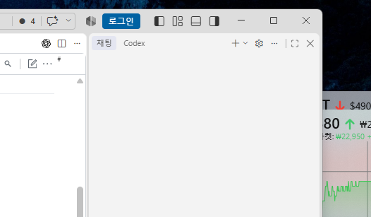
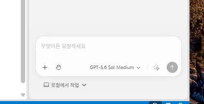
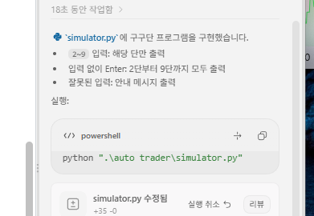

# ai-vibecoding-2026

바이브코딩 리포지토리

### chapter 1

---

ai에게 코딩을 시키자, 제대로!

### 개념

코딩을 직접하지는 말 것. ai와 협업해서 새로운 프로그램을 만들자

#### 기존 개발 방법

요구사항 분석 -> 설계(DB/UI) -> 구현/디버깅 -> 테스트 -> 배포 -> 유지보수

### 바이브코딩 방식

요구사항정의(PRD) - ai가 코드 생성/디버깅, 테스트 -> 사람 **검증** 수정요청, 직접수정 -> 배포

-> AI유지보수

#### 핵심 포인드

- ai - 주니어/시니어 개발
- 사람 - pm + 리뷰어

### 바이브코딩 개발환경

- vs code, vs code insider,android studio, ...

### vs code

- 채팅창 - 안쓴다
- 확장 - 패키지 - codex, claude code for vs code, gemini code assist

#### Codex

- 설치 후 확장 아이콘 아래, codex 아이콘 생성 됨
- 
- 로그인 - 웹브라우저 연결
- 설정화면 설정 필요
- sand box 뜨면 설치
- 
- 최종화면
- 채팅 창 명령 / 여러 LLM에 전달할 명령어 리스트

#### 맛보기 바이브코딩

- 제로샷 프롬프트로 요청
- 
-

#### CLI codex

- 파워셀, 콘솔 창에서 명령어로 수행하는 codex
-
