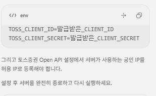
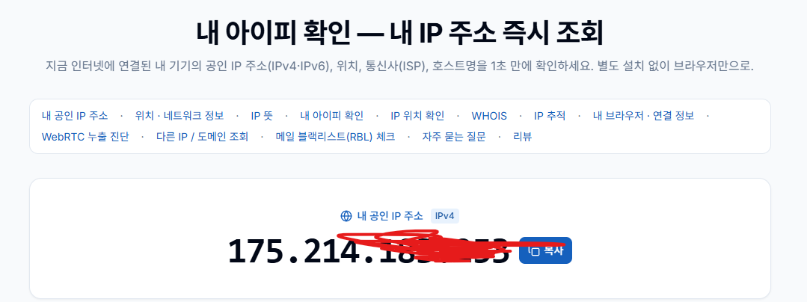
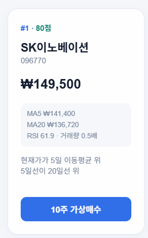

# ai-vibecoding-2026

바이브코딩 리포지토리

### chapter 1

---

ai에게 코딩을 시키자, 제대로!

### 개념

코딩을 직접하지는 말 것. ai와 협업해서 새로운 프로그램을 만들자

#### 기존 개발 방법

요구사항 분석 -> 설계(DB/UI) -> 구현/디버깅 -> 테스트 -> 배포 -> 유지보수

### 바이브코딩 방식

요구사항정의(PRD) - ai가 코드 생성/디버깅, 테스트 -> 사람 **검증** 수정요청, 직접수정 -> 배포

-> AI유지보수

#### 핵심 포인드

- ai - 주니어/시니어 개발
- 사람 - pm + 리뷰어

### 바이브코딩 개발환경

- vs code, vs code insider,android studio, ...

### vs code

- 채팅창 - 안쓴다
- 확장 - 패키지 - codex, claude code for vs code, gemini code assist

#### Codex

- 설치 후 확장 아이콘 아래, codex 아이콘 생성 됨
- 
- 로그인 - 웹브라우저 연결
- 설정화면 설정 필요
- sand box 뜨면 설치
- 
- 최종화면
- 채팅 창 명령 / 여러 LLM에 전달할 명령어 리스트

#### 맛보기 바이브코딩


- 제로샷 프롬프트로 요청
- 
-

#### CLI codex

- 파워셀, 콘솔 창에서 명령어로 수행하는 codex

### 바이브 코딩

- 제로샷 프롬프트 : 아무런 기초지식없이 대화로 바이브 코딩시작
- 원샷 프롬프트 : 적어도 한줄의 요구사항을 작성해서 바이브코딩시작
- 퓨샷 프롬프트 : PRD를 작성해서 바이브코딩

#### 프롬프트 사용법

- 이미지를 캡쳐해서 복사/붙여넣기 후 프롬프트 사용
- 특정 소스코드를 선택한 뒤 우클릭으로 Add to Codex Threaed 선택후 프롬프트 사용

## 주식 자동매매 개발환경

### 토스증권 openapi

- https://corp.tossinvest.com/ko/open-api
- 토스앱 모바일 설치 가입
- 토스증권 사용 설정
- 토스증권 pc 웹사이트
- 사용중인 아이피를 토스증권 ,pc 등록
- cmd 에서 ipconfig 하면 나의 ip 주소를 알수 있음
- open api - ip추가해서 내 ip 추가해야됨
- openapi 키 발급 후 client id, client secret 문자열 보관
-
- [https://developers.tossinvest.com/docs](https://developers.tossinvest.com/docs) 토스증권 개발자 센터

`codex 명령어` -

주식 자동매매 시스템을 만들고 싶어. 근데 토스증권 api를 사용할 거야.

https://developers.tossinvest.com/docs

이주소 학인해서 일단 문서 분석해줘

- 나는 파이썬 + fastapi로 자동매매 프로그램을 개발할거야. 이내용도 분석해서  prd.md에 추가해줘

## API 신청

- client id, `client secert`, 컴퓨터 ip 추가
- cmd > ipconfig로 확인
- 최초에는 가상금액으로 자동매매를 시작할꺼야. 어느정도 안정화 된 후 실제 계좌금액으로 매매를 할거야. 이 내용도 prd에 추가해줘
- prd.md를 분석해서 내용을 축약해줘. 내용이 너무 긴거 같아

#### 주식 자동매매 파이썬 프로그램 분석

-`__init__.py` - 일반적으로 파일만 생성. 소스코드 x 프로젝트 폴더가 pip로 설치할 수 있는 패키지화

- `__main__.py` - 파이썬으로 실행될때 가장 먼저 실행되는 메인
- `__pycache__` - 미리 만들어 놓은 파이썬 실행 파일(캐시)
- test - 소스코드 테스트 실행을 위한 폴더
- .env.example-환경설정 예제파일.example을 지우고 사용(보통 복사해서 .env만들어서 쓴다)
- .env는 깃허브에 업로드 방지위해 .gitignore에 제외파일로 등록
- requirements.txt = 파이썬 개발환경 패키지 설치리스트 파일
  - `pip install -r requirements.txt` 로 전부 설치
- ctrl + , - 설정 - ㅡmouse zoom , minimap 체크

바이브 코딩할때 -지난번에 어디까지 작업했는지 설명해줘

만약에 설정파일이 없으면  .env.example을 만들어줘 파일 내에느 가장 필요한설정값 예시를 작성해줘

- 서버 실행할려면 어떻게 해야해? 명령어를 알려줘
- 2단계 구현 시작하면서 프론트엔드도 같이 만들어줘
- 
- `구글에서 공인아이피 확인해서 토스설정에 넣어줘야한다`
- `https://myip.co.kr/util/what-is-myip/`
- 

현재까지가 v0.2네 . 프로젝트 폴더에 있는 현재까지 내용을 압축해줘. 프로젝트 폴더에 있는 env에 키는 그대로두고 압축한 .env파일에는 키를 삭제하고 압축해줘

- `flaticon.com - 아이콘이 무료다`
- 구글에서 png to ico 검색해서 png파일을 `favicon.ico`으로 바꾼다
- D:\cho\ai-vibecoding-2026\app\static 여기에 파일을 넣는다
-
- 채팅창에 link를 index.html에 추가하면 된다
- ```
  <link rel="icon" href="/static/favicon.png" type="image/png">
  ```

<link rel="icon" href="/static/favicon.png" type="image/png">

<link rel="icon" href="/static/favicon.png" type="image/png">-

- auto\_trader 폴더 아래에서 작업해줘

화면 오른쪽 상단에 버튼스타일로 3개를추가해줘. 첫번째는 새로고침버튼, 2번째는 토스api와 연결되었는지확인하는 버튼,구래서 api와 연결이 안되어있으면 빨간색 버튼으로 '연결실패'라고 보여줘. 세번째 버튼은 paper인지 실제금액 주문인지 표시해줘

- 현재 조회 입력창에 한글로 이름이나 코드를쳐조 조회가 왼도.엔터로 조회가 되도록 수정해즈고 주식이름도 표현해줘.그러니깐 종목번호 주식명 해줘 그리고 종목번호 ->주식명->현재가->통화 순서로 표현해줘
- 토스증권 시세조회와 가상 포트폴리오 사이에 가상계좌 금액과 이번 추천에 사용할 금액을 표시해줘. 여기가 나중에 실제금액이 나올 부분이야
- 테마를 변경하는 토글버튼 만들어줘. DARK와 LIGHT 두가지로 변경하게 해줘. 토글버튼은 왼쪽 하단에 floating르로 떠있게 만들어줘.
- .env에 아래 소스코드를 넣으면 50프로의 비율로 사용을 하는 코드다
- ```
  RECOMMENDED_TRADE_RATIO=0.50
  ```
- 이 값을 추천 거래금액으로 할꺼야 이 금액이 화면에 동적으로 나오도록 수정해줘
- 이번 추천 사용 금액을 가지고 매매르 할 추천종목을 top5만 리스트업해줘. 예를 들어 현재 400만원이야 그펴에 추천후보찾기 버튼을 누르면, 매매가능금액  카드 아래에 그림과 같이 나오도록 만들어줘



**추천 후보 TOP 5**
전체 2,601개 → 예산·유동성 30개 → 위험 제외 12개 → 지표 분석 12개

이전에 다른 매매프로그램 구현을 위와 같이 했어

이렇게 추천후보 top5를 골라서 조회할때마다 랜덤하게 나오도록 수정해줘

- 아래칸에 한주간 해외 국내 이슈를 정리해서 보고서를 작성해서 주간 리포터분석이란 부분을 작성해주고 그 리포트를 바탕으로 분석해서 투자하는 방향으로 만들어줘
- 차트 수정은 나중에 하고, 주식명을 다시 클릭하면 차트카드를 숨겨줘
- 주간 일간 리포트를 나눠주고 해외이슈3 국내이슈2 중복되는 이슈 빼고 볼수 있게 정리해주고 일간은 매일 저녁에 리뉴얼하고 주간은 주말 일요일에 리뉴얼 하는걸로 정리하자 즐겨찾기 버튼을 만들어서 중요한 정보는 즐겨찾기해서 볼수 있도록 만들어줘 즐겨찾기 데이터를 정리할수 있게 삭제할수 있는 버튼도 만들어줘
- 차트에 5일 이동평균선, 20일 이동평균선, 60일 120일 이동평균선을 넣어줘
