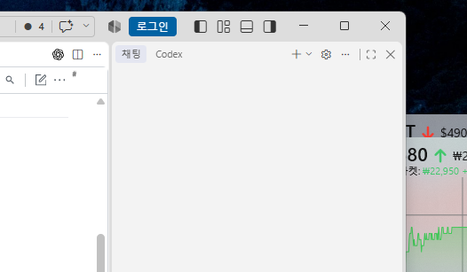
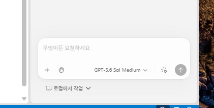
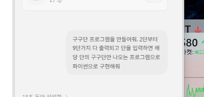
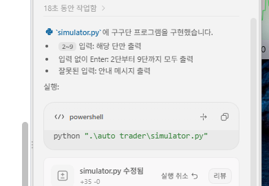
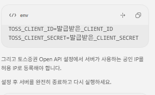
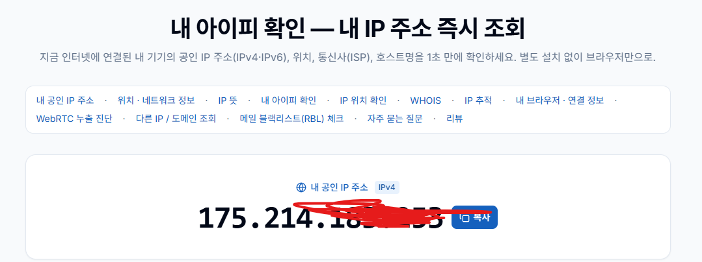
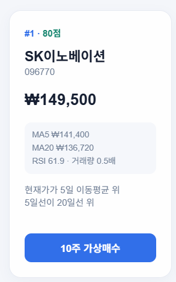

# ai-vibecoding-2026

## 현재 자동매매: 대형주 테마 스윙 (swing-v2-mtf-4h)

- 기본 실행 전략은 PAPER 스윙입니다. 아래의 과거 오전 단타·10분할·시간 청산 설명은 현재 전략에 적용되지 않습니다.
- 관심 그룹은 `app/swing_themes.json`에서 관리합니다. AI·반도체, 전력·전자 인프라, 방산, 조선, 자동차·모빌리티, 배터리·소재의 6개 그룹 44종목으로 검색 범위를 확대했습니다. 이 목록은 장기 지속성이 자동 검증된 투자 추천 목록이 아닙니다. 그룹 `enabled`와 `symbols`를 수정하면 다음 검색부터 반영됩니다.
- 대상은 등록 그룹의 국내 보통주 중 현재가 × 발행주식 수가 1조 원 이상인 종목입니다. 기준은 같은 파일의 `minimum_market_cap_krw`로 변경합니다. 당일 거래대금 순위나 무작위 추출을 사용하지 않습니다.
- 매수 추세: 완료된 일봉 기준 MA20 > MA60이거나, 현재가가 MA60 이상이면서 MA20이 5거래일 전보다 상승해야 합니다. 완료 주봉의 최근 종가가 MA10 이상이거나 MA10이 상승해야 합니다. 최소 60개 완료 일봉과 52개 완료 주봉을 확인합니다. 최근 52주에서 현재가 위에 있는 가장 가까운 확정 스윙 전고점 또는 최고가의 5% 이내는 제외합니다.
- 주봉 매수 관심 구간: 최근 20개 완료 주봉의 고저 범위 하위 40% 이하이면서 그 최저가의 97% 이상이어야 합니다. `최근 20주 최저가 × 0.97 <= 현재가 <= 최저가 + (최고가 - 최저가) × 0.40`를 확인하여 주봉 고점과 저점 3% 하회 구간을 제외합니다. 현재 주·미래 주는 제외하고, 마지막 주봉이 14일을 넘겨 지연되거나 OHLC가 유효하지 않으면 신규 매수를 보류합니다. 일봉에서 주봉을 만들 때 주중 전체 고가·저가를 보존합니다.
- 매수 가격: 완료된 최근 6개 4시간봉 종가 평균 ± 모집단 표준편차 2배인 BB(6,2)를 사용합니다. `현재가 <= min(하단 × 1.03, 하단 + 밴드 폭 × 0.25)`와 `현재가 <= 최근 20개 완료 일봉 최저가 + (최고가 - 최저가) × 0.40`, 위 주봉 관심 구간을 모두 충족해야 합니다. 최종 매수 상한은 주봉·일봉·4시간 상한 중 가장 낮은 값입니다. 진행 중인 봉·당일 일봉과 7일을 넘겨 지연된 4시간봉으로 매수 신호를 만들지 않습니다. LIVE 주문 직전에는 실제 매수 호가도 같은 조건을 통과해야 합니다. 바닥 가격의 확정이나 수익을 보장하는 조건은 아니며, 기준값은 이번 요청에 따라 정한 값으로 수익성 최적화 결과가 아닙니다.
- 일반 익절: 4시간봉 볼린저 상단 조건과 `SWING_MIN_NET_PROFIT_PERCENT` 기본 3% 이상의 예상 순수익을 모두 충족해야 합니다. LIVE에서는 매도 1호가에 `SLIPPAGE_BPS` 여유를 차감하고, 매입 평균가에 추정 매수 수수료를 더한 원가 대비 매도 수수료·세금을 제외한 순수익을 계산합니다. 수수료는 `FEE_RATE`, 국내 보통주 매도 세금 추정은 `LIVE_SELL_TAX_RATE` 기본 0.002(0.20%)를 사용합니다([토스증권 국내주식 거래설명서](https://home-files.tossinvest.com/files/notice/f8b692a8-2b29-46c4-b279-f6bf865e64d5.pdf), 2026-10-07 확인). 실제 거래 비용과 체결 수익을 확정하는 값은 아닙니다. PAPER는 가상 브로커의 수수료·슬리피지로 계산하고 LIVE 세금은 부과하지 않습니다.
- 추적매도: 상단을 터치한 후 고점에서 2% 하락한 예상 매도 가격에서도 비용 차감 후 3%가 남는 수준에 도달해야 활성화됩니다. 현재 호가 차이와 슬리피지 여유도 차감합니다. 활성화 상태·시각·적용 비율을 저장하여 재시작과 날짜 변경 후 복구합니다. 활성화 이후 고점 대비 2% 하락 시 보호 매도를 허용하며, 급락으로 예상 수익이 3% 미만이어도 작동합니다. 기존 상단 터치 기록만으로 새 추적매도를 활성화하지 않습니다. 종목별 마지막 판단에 호가·예상 순수익·추적 기준·사유를 저장합니다.
- 손절은 평균 매입가 -3%로 최소 수익률과 독립적으로 작동합니다. LIVE에서는 `LIVE_MAX_POSITION_LOSS_PERCENT`를 사용하며, 유효한 최신 매도 호가가 있으면 캔들 조회 실패 시에도 손절과 이미 활성화된 보호 매도를 판단합니다. 수동 전량 매도 역시 최소 수익률로 제한하지 않습니다. LIVE는 느린 지표 조회 후 매도 직전 호가와 조건을 재확인하고 기존 10초 호가 검사를 적용합니다. 손절·익절·보호 조건이 없으면 여러 날 보유합니다.
- 평일 정규장 09:00~15:30와 애프터마켓 16:00~20:00에 5분마다 확인합니다. 자동 신규 매수 시간은 09:00~10:00, 12:00~14:00, 16:00~20:00입니다. PAPER 주문 가격은 당일 거래량이 있는 120초 이내 분봉으로 검증하고 LIVE 주문에는 10초 이내 양방향 호가를 확인합니다.
- 4시간 차트는 매수·매도 판단과 같은 완료 4시간봉 BB(6,2)를 표시합니다. 주봉 차트는 완료 주봉 BB(20,2)와 최근 20주 관심 가격 구간을 녹색으로 표시합니다. 다른 시간 단위에서는 기존 일봉 BB(20,2)를 표시하며, 이동평균은 일봉 기준임을 명시합니다. 추천 카드에는 주봉 관심 구간과 최종 매수 상한을 표시합니다.
- 자동매매 예산은 `RECOMMENDED_TRADE_RATIO`로 설정합니다. LIVE에서는 `LIVE_AUTO_MAX_TOTAL_EXPOSURE_RATIO` 기본 15%와 총 보유 한도 중 작은 값을 적용하고 보유 평가액·미체결 매수를 차감합니다. 최대 5종목에 균등 배분하여 종목당 총자산의 3% 이내에서 수수료 포함 정수 수량을 계산합니다. 직접 매수는 별도 `MANUAL_TRADE_RATIO`와 화면의 `직접 매수 1회 총자산 비율`로 조절하며 자동매매 비율을 바꾸지 않습니다. 직접 매수에도 합산 보유 한도와 가용 현금·미체결·주문 금액 한도를 적용합니다. 기존 보유가 한도를 넘으면 신규 매수만 중단하며 한도 변경만으로 강제 매도하지 않습니다.
- 기존 자동매매 주문 이력과 보유분은 처음 실행할 때 스윙 기록으로 승계합니다. 화면에서 직접 매수한 종목과 실제 체결된 부분 체결 수량도 자동매도 대상입니다. 실행 중 토스 앱에서 수동 매수한 국내 보유분은 다음 5분 검사에서 계좌 동기화에 성공하면 미등록 수량만 승계하며 허구의 매수 주문을 만들지 않습니다. 수동·자동 보유분 모두 신규 매수 조건과 무관하게 같은 손절·예상 순수익 3% 이상 익절·활성화 후 추적매도 규칙으로 감시합니다. 자동매도에는 엔진 실행과 LIVE 동기화·무장, 거래시간과 최신 호가가 필요합니다. 계좌·현금·주문을 초기화하지 않습니다. 재시작과 날짜 변경으로 중복 매수하지 않습니다.
- 성과 표는 진입일·종목별 누적 기록입니다. 청산되지 않은 거래는 실현 수익률에서 제외합니다. 이전 자동매매 기록도 함께 표시합니다.
- 화면의 `현재 매매전략`에서 실제 검색·매수·매도·운영시간·자금관리 기준을 확인할 수 있습니다. `매수 자리 도달`에는 자동 매수 조건을 모두 통과한 종목만 표시합니다. `매수 자리 근접 · 조건 대기`에는 주봉·일봉 저가 구간을 통과하고 최종 매수 상한의 3% 이내에 있는 후보만 표시하며 자동 주문하지 않습니다. 고점·주봉 지지 이탈·자료 부족 종목은 두 목록에서 제외하고 탈락 진단·신호 기록에 사유를 남깁니다.
- 장중 자동 검색과 사용자가 누른 추천 검색은 종목별 현재가, MA20·MA60, 볼린저 상·하단, 하단 거리, 조건 통과 수와 탈락 사유를 `signal_observations` 테이블에 누적합니다. `GET /api/v1/swing/signal-history`에서 최근 데이터를 확인할 수 있습니다.
- 조건 근접 관찰 후보는 정규장에 `1주 PAPER 테스트 매수`로 가상 주문 흐름을 검증할 수 있습니다. 핵심 조건 3개 중 2개 이상을 통과한 등록 테마·시가총액 1조 원 이상 종목만 허용하고, 주문에는 `paper-test-buy` 표식을 남깁니다. 테스트 보유분도 기존 볼린저 상단 매도 또는 전량 매도 버튼으로 청산합니다.
- 보유 종목의 `전량 매도` 버튼으로 목표가와 무관하게 수동 PAPER 청산할 수 있습니다. 자동매매가 중지된 상태에서도 사용 가능하며, 국내 종목의 평일 09:00~15:30 유효한 현재 시세가 필요합니다. 킬 스위치 활성 중에는 주문하지 않습니다. 수동 청산 종목은 당일 자동 재매수에서 제외하고 주문·성과 기록에 매도를 반영합니다.

실행: `python -m uvicorn app.main:app --host 127.0.0.1 --port 8000`

### LIVE 실계좌 대시보드

- `TRADER_MODE=live`, `LIVE_TRADING_ENABLED=true`로 실행하면 추천 종목 매수와 보유 종목 매도가 LIVE 전용 API로 연결됩니다. 수동 주문에는 API 토큰 인증과 `confirm_real_order=true` 확인이 필요합니다. PAPER 주문 API는 LIVE에서 차단됩니다.
- 재시작 후에는 계좌 동기화와 수동 무장이 필요합니다. 자동매매 시작 후 전략 조건을 통과한 주문이 실제 계좌로 제출됩니다. 연결 실패·미확인 주문 상태에서는 무장을 해제하고 주문을 보류합니다.
- `LIVE_SYMBOL_POLICY=allowlist`에서는 최신 추천 조건과 `LIVE_ALLOWED_SYMBOLS`를 모두 통과해야 매수합니다. `recommended`에서는 최신 추천 조건을 통과한 국내 종목을 매수하며 기존 보유분은 추천 여부와 무관하게 매도할 수 있습니다. 관찰 후보는 LIVE에서 매수하지 않습니다.
- 신규 매수는 보유 평가액과 미체결 매수 금액을 포함한 총자산 비율로 제한합니다. 기본 15%는 미만 기준이며 `LIVE_MAX_TOTAL_EXPOSURE_RATIO=1.0`이면 100% 이내 기준입니다. 가용 현금·수수료·종목 수·일일 손실 한도도 적용합니다. `LIVE_MAX_ORDER_AMOUNT_KRW=0`, `LIVE_MAX_TOTAL_EXPOSURE_KRW=0`은 추가적인 고정 원화 금액 상한을 해제하며 현금과 자산 비율 검사는 계속 적용합니다.
- LIVE 총 투자예산은 최대 5종목에 균등 배분합니다. 신규 종목의 주문 예산은 `총 투자예산 / 5`와 보유 평가액·미체결 매수를 차감한 가용 예산 중 작은 금액입니다. 수수료를 포함해 정수 수량을 계산하고 1주 예산이 부족한 종목은 건너뜁니다. 기존 보유 종목에는 추가 매수하지 않으며 미체결 매수도 보유 자리를 예약합니다. 추천 수량과 선택·자동 매수에 같은 배분 기준을 적용합니다.
- 실계좌 수동 매수와 매도는 최신 양방향 호가로 시장가 주문을 제출합니다. 부분 체결·미체결 잔량은 취소 확인 후 실제 체결 수량으로 기록합니다. 주문 결과가 불명확하면 반복 주문하지 않고 계좌와 주문 상태를 복구해야 합니다.
- 주문 실패 시 HTTP 상태와 토스 오류 코드를 저장합니다. 알려진 확정 거절은 `REJECTED`로 기록하고 타임아웃·불명확한 응답은 `UNKNOWN`으로 잠급니다. 계좌 제한·필수 동의·거래소 설정 문제는 무장을 해제합니다. 주문번호가 없는 오래된 UNKNOWN 주문은 대시보드의 `미확인 실주문 검토`에서 토스 주문내역의 미접수를 직접 확인한 후 정리할 수 있습니다. 서버가 OPEN·CLOSED 주문을 다시 확인하며 발견되거나 조회에 실패하면 정리를 거부합니다. 기록은 삭제하지 않고 `NOT_SUBMITTED`로 보존하며 자동 무장하지 않습니다.
- LIVE 비율 설정은 인증을 요구합니다. 자동매매는 기본 최대 15%, 직접 매수는 합산 총자산 한도 이내에서 별도로 조절합니다. `PUT /api/v1/settings/manual-investment-ratio`로 직접 매수 비율을 저장하고, 조건 확인 매수 API의 선택적 `ratio_percent`로 해당 주문의 비율을 지정할 수 있습니다. 이전에 저장한 100% 자동 설정도 자동매매 상한을 넘으면 재시작 때 적용하지 않습니다. PAPER 자동매매 비율은 최대 50%, 직접 매수 비율은 최대 100%입니다. 실제 비밀정보는 `.env`에만 보관하고 `.env.example`에는 넣지 않습니다.
- 현재 PC의 `http://127.0.0.1:8002` 또는 `localhost` 대시보드는 서버가 발급한 HttpOnly 인증 쿠키로 연결되므로 토큰 입력창이 나오지 않습니다. 쿠키는 8시간 또는 서버 재시작 시 만료되며 화면에서 자동 갱신합니다. 자동 인증은 로컬 접속과 동일 출처 요청에 한정합니다. 외부 API 도구의 `X-API-Token` 인증은 계속 지원합니다.

### DB와 매매 내역 저장 위치

- 기본 SQLite 파일은 `data/auto_trader.db`이며 `.env`의 `DATABASE_PATH`로 지정합니다.
- `trade_orders` 테이블에 매수·매도 주문 한 건을 한 행으로 저장하고, `portfolio_positions` 테이블에는 현재 보유 종목명·수량·평균 매입가·매입금액을 종목별 한 행으로 저장합니다. 원본 가상계좌 상태도 `snapshots` 테이블의 `name='paper_account'` 행에 보관합니다.
- 주문에는 종목, 매수/매도, 수량, 요청가·체결가, 수수료, 체결 상태, 주문 시각이 포함됩니다. 현재 저장 방식은 최근 1,000건을 유지합니다.
- 스윙매매 세션·진단은 같은 테이블의 `swing_sessions`에 저장합니다. 화면의 매매 내역과 `GET /api/v1/orders`에서 주문을 확인할 수 있습니다.
- 검색·신호 학습 데이터는 별도 `signal_observations` 테이블에 계속 추가되므로 체결 조건이 드문 날에도 분석 데이터가 쌓입니다.
- 기존 `data/paper_trader.db`는 이번 변경 전 백업으로 보관하며, 현재 서버는 `data/auto_trader.db`를 사용합니다.


바이브코딩 리포지토리

### chapter 1

---

ai에게 코딩을 시키자, 제대로!

### 개념

코딩을 직접하지는 말 것. ai와 협업해서 새로운 프로그램을 만들자

#### 기존 개발 방법

요구사항 분석 -> 설계(DB/UI) -> 구현/디버깅 -> 테스트 -> 배포 -> 유지보수

### 바이브코딩 방식

요구사항정의(PRD) - ai가 코드 생성/디버깅, 테스트 -> 사람 **검증** 수정요청, 직접수정 -> 배포

-> AI유지보수

#### 핵심 포인드

- ai - 주니어/시니어 개발
- 사람 - pm + 리뷰어

### 바이브코딩 개발환경

- vs code, vs code insider,android studio, ...

### vs code

- 채팅창 - 안쓴다
- 확장 - 패키지 - codex, claude code for vs code, gemini code assist

#### Codex

- 설치 후 확장 아이콘 아래, codex 아이콘 생성 됨
- 
- 로그인 - 웹브라우저 연결
- 설정화면 설정 필요
- sand box 뜨면 설치
- 
- 최종화면
- 채팅 창 명령 / 여러 LLM에 전달할 명령어 리스트

#### 맛보기 바이브코딩



- 제로샷 프롬프트로 요청
- 
-

#### CLI codex

- 파워셀, 콘솔 창에서 명령어로 수행하는 codex

### 바이브 코딩

- 제로샷 프롬프트 : 아무런 기초지식없이 대화로 바이브 코딩시작
- 원샷 프롬프트 : 적어도 한줄의 요구사항을 작성해서 바이브코딩시작
- 퓨샷 프롬프트 : PRD를 작성해서 바이브코딩

#### 프롬프트 사용법

- 이미지를 캡쳐해서 복사/붙여넣기 후 프롬프트 사용
- 특정 소스코드를 선택한 뒤 우클릭으로 Add to Codex Threaed 선택후 프롬프트 사용

## 주식 자동매매 개발환경

### 토스증권 openapi

- https://corp.tossinvest.com/ko/open-api
- 토스앱 모바일 설치 가입
- 토스증권 사용 설정
- 토스증권 pc 웹사이트
- 사용중인 아이피를 토스증권 ,pc 등록
- cmd 에서 ipconfig 하면 나의 ip 주소를 알수 있음
- open api - ip추가해서 내 ip 추가해야됨
- openapi 키 발급 후 client id, client secret 문자열 보관
-
- [https://developers.tossinvest.com/docs](https://developers.tossinvest.com/docs) 토스증권 개발자 센터

`codex 명령어` -

주식 자동매매 시스템을 만들고 싶어. 근데 토스증권 api를 사용할 거야.

https://developers.tossinvest.com/docs

이주소 학인해서 일단 문서 분석해줘

- 나는 파이썬 + fastapi로 자동매매 프로그램을 개발할거야. 이내용도 분석해서  prd.md에 추가해줘

## API 신청

- client id, `client secert`, 컴퓨터 ip 추가
- cmd > ipconfig로 확인
- 최초에는 가상금액으로 자동매매를 시작할꺼야. 어느정도 안정화 된 후 실제 계좌금액으로 매매를 할거야. 이 내용도 prd에 추가해줘
- prd.md를 분석해서 내용을 축약해줘. 내용이 너무 긴거 같아

#### 주식 자동매매 파이썬 프로그램 분석

-`__init__.py` - 일반적으로 파일만 생성. 소스코드 x 프로젝트 폴더가 pip로 설치할 수 있는 패키지화

- `__main__.py` - 파이썬으로 실행될때 가장 먼저 실행되는 메인
- `__pycache__` - 미리 만들어 놓은 파이썬 실행 파일(캐시)
- test - 소스코드 테스트 실행을 위한 폴더
- .env.example-환경설정 예제파일.example을 지우고 사용(보통 복사해서 .env만들어서 쓴다)
- .env는 깃허브에 업로드 방지위해 .gitignore에 제외파일로 등록
- requirements.txt = 파이썬 개발환경 패키지 설치리스트 파일
  - `pip install -r requirements.txt` 로 전부 설치
- ctrl + , - 설정 - ㅡmouse zoom , minimap 체크

바이브 코딩할때 -지난번에 어디까지 작업했는지 설명해줘

만약에 설정파일이 없으면  .env.example을 만들어줘 파일 내에느 가장 필요한설정값 예시를 작성해줘

- 서버 실행할려면 어떻게 해야해? 명령어를 알려줘
- 2단계 구현 시작하면서 프론트엔드도 같이 만들어줘
- 
- `구글에서 공인아이피 확인해서 토스설정에 넣어줘야한다`
- `https://myip.co.kr/util/what-is-myip/`
- 

현재까지가 v0.2네 . 프로젝트 폴더에 있는 현재까지 내용을 압축해줘. 프로젝트 폴더에 있는 env에 키는 그대로두고 압축한 .env파일에는 키를 삭제하고 압축해줘

- `flaticon.com - 아이콘이 무료다`
- 구글에서 png to ico 검색해서 png파일을 `favicon.ico`으로 바꾼다
- D:\cho\ai-vibecoding-2026\app\static 여기에 파일을 넣는다
-
- 채팅창에 link를 index.html에 추가하면 된다
- ```
  <link rel="icon" href="/static/favicon.png" type="image/png">
  ```

<link rel="icon" href="/static/favicon.png" type="image/png">

<link rel="icon" href="/static/favicon.png" type="image/png">-

- auto\_trader 폴더 아래에서 작업해줘

화면 오른쪽 상단에 버튼스타일로 3개를추가해줘. 첫번째는 새로고침버튼, 2번째는 토스api와 연결되었는지확인하는 버튼,구래서 api와 연결이 안되어있으면 빨간색 버튼으로 '연결실패'라고 보여줘. 세번째 버튼은 paper인지 실제금액 주문인지 표시해줘

- 현재 조회 입력창에 한글로 이름이나 코드를쳐조 조회가 왼도.엔터로 조회가 되도록 수정해즈고 주식이름도 표현해줘.그러니깐 종목번호 주식명 해줘 그리고 종목번호 ->주식명->현재가->통화 순서로 표현해줘
- 토스증권 시세조회와 가상 포트폴리오 사이에 가상계좌 금액과 이번 추천에 사용할 금액을 표시해줘. 여기가 나중에 실제금액이 나올 부분이야
- 테마를 변경하는 토글버튼 만들어줘. DARK와 LIGHT 두가지로 변경하게 해줘. 토글버튼은 왼쪽 하단에 floating르로 떠있게 만들어줘.
- .env에 아래 소스코드를 넣으면 50프로의 비율로 사용을 하는 코드다
- ```
  RECOMMENDED_TRADE_RATIO=0.50
  ```
- 이 값을 추천 거래금액으로 할꺼야 이 금액이 화면에 동적으로 나오도록 수정해줘
- 이번 추천 사용 금액을 가지고 매매르 할 추천종목을 top5만 리스트업해줘. 예를 들어 현재 400만원이야 그펴에 추천후보찾기 버튼을 누르면, 매매가능금액  카드 아래에 그림과 같이 나오도록 만들어줘



**추천 후보 TOP 5**
전체 2,601개 → 예산·유동성 30개 → 위험 제외 12개 → 지표 분석 12개

이전에 다른 매매프로그램 구현을 위와 같이 했어

이렇게 추천후보 top5를 골라서 조회할때마다 랜덤하게 나오도록 수정해줘

- 아래칸에 한주간 해외 국내 이슈를 정리해서 보고서를 작성해서 주간 리포터분석이란 부분을 작성해주고 그 리포트를 바탕으로 분석해서 투자하는 방향으로 만들어줘
- 차트 수정은 나중에 하고, 주식명을 다시 클릭하면 차트카드를 숨겨줘
- 주간 일간 리포트를 나눠주고 해외이슈3 국내이슈2 중복되는 이슈 빼고 볼수 있게 정리해주고 일간은 매일 저녁에 리뉴얼하고 주간은 주말 일요일에 리뉴얼 하는걸로 정리하자 즐겨찾기 버튼을 만들어서 중요한 정보는 즐겨찾기해서 볼수 있도록 만들어줘 즐겨찾기 데이터를 정리할수 있게 삭제할수 있는 버튼도 만들어줘
- 차트에 5일 이동평균선, 20일 이동평균선, 60일 120일 이동평균선을 넣어줘


## 이전 전략: 추천 후보 및 신규 매수 필터 (현재 자동매매에는 미적용)

- 상승 추세: 20일선 > 60일선, 두 이동평균 모두 5거래일 전보다 상승, 현재가 > 60일선.
- 추천 진입 신호: 기존 일봉 지지 접촉 또는 최신 일봉의 볼린저 하단 접촉 후 현재가가 하단선 이상으로 회복. 두 경우 모두 주봉 지지 거리 12% 이내, 일봉 저항 여력 3% 이상, 주봉 저항 여력 5% 이상을 요구합니다. 볼린저 진입은 현재가가 일봉 지지선 이상이어야 합니다.
- 볼린저 밴드: 최신 일봉을 포함한 20개 종가 평균 ± 모집단 표준편차 2배. 장중에는 값이 변할 수 있습니다.
- 과열 제외: RSI(최근 14개 등락의 단순평균) 70 이상, 당일 7% 이상 상승, 5거래일 10% 이상 상승, 20거래일 20% 이상 상승, 20일선 위 이격률 8% 이상 중 하나라도 해당하면 제외합니다. 초기 전략 기준이며 백테스트로 검증된 수익 기준은 아닙니다.
- 추천은 상승 추세·과열 제외와 진입 신호를 모두 통과한 종목만 최대 5개 표시합니다. 조건 미달이면 5개를 채우지 않습니다. 추천만으로 전략 등록이나 주문이 실행되지는 않습니다.
- 신규 매수용 일봉은 종목별로 60초 캐시하고 현재가는 매번 반영합니다. 토스 일봉이 없거나 부족하거나 오래됐거나 조회에 실패하면 매수를 보류합니다.

## 이전 전략: 추천 기반 가상 자동매매 (현재 자동매매에는 미적용)

- 화면의 `가상 자동매매 시작`을 누르면 시작 시점의 `min(가용 KRW 현금, KRW 총자산 × RECOMMENDED_TRADE_RATIO)`을 고정 예산으로 저장합니다. PAPER 전용이며 토스 API는 시세 조회에만 사용합니다.
- 1분 간격으로 추천 후보를 탐색합니다. 후보가 없어도 대기하며, 주문 직전에 상승 추세·과열·지지 또는 볼린저 접촉 조건을 다시 검사합니다.
- 최대 5종목, 종목당 시작 예산의 1/5 이내에서 정수 수량을 매수합니다. 방어적 시장 판단이면 종목별 배분을 절반으로 줄입니다. 수수료·슬리피지·가용 현금·1회 주문 한도를 반영하므로 남는 금액은 현금으로 유지됩니다.
- 이번 자동매매가 매수한 종목만 매도합니다. 진입 때 정한 일봉·주봉 저항 중 낮은 가격에서 익절하고, 가상 체결 매수가보다 3% 하락하면 손절합니다. 기존 보유 종목과 저장된 가격 조건 전략은 이번 자동매매에서 실행하거나 관리하지 않습니다.
- 자동 매매 회차별 총 누적 매수액이 예산을 넘지 않으며, 매도 대금은 재투자하지 않습니다. 같은 종목도 해당 회차에서 재매수하지 않습니다.
- `중지` 또는 `긴급 중지`는 매수·매도 감시를 멈추며 강제 청산하지 않습니다. `재개`하면 같은 예산·주문 내역·매도 기준으로 이어갑니다. 서버 재시작 후에도 회차를 복원하지만 기본값 `AUTO_START=false`에서는 시작 버튼을 눌러야 실행됩니다.
- 새 회차는 엔진 중지 후 가상계좌 초기화 API(`/api/v1/paper/reset`)로 시작할 수 있습니다. 이 API는 기존 가상 잔고와 보유·주문 내역도 초기화하므로 단순 재개에는 사용하지 않습니다.
- 체결은 조회한 REST 현재가에 수수료와 슬리피지를 적용하는 로컬 모의 체결입니다. 실제 거래소 체결·호가 대기열·휴장 여부를 재현하지 않습니다. 실제 주문 전송 기능은 없습니다.

## 현재 전략: 오전 8시 대형주 볼린저 반등 단타

- 가상계좌 전용. 시작 버튼은 스케줄 감시를 켭니다. 한국시간 평일 08:00~08:05에 첫 유효 신호가 나온 1종목에 1차 매수하고, 같은 종목만 최대 10분할 매수합니다. 8시 정각에는 당일 반등 분봉이 없을 수 있으므로 이 5분 확인 구간을 둡니다. 해당 시간에 서버와 엔진이 켜져 있어야 합니다.
- 거래대금 순위 최대 30개 중 원화 보통주·시가총액 1조 원 이상 대상을 순위대로 최대 12개 분석합니다. 과거의 무작위 추출·주봉 저항 여력 조건은 이 전략에 적용하지 않습니다.
- 전일까지 완료된 20개 일봉 종가로 볼린저(20, 2)를 계산합니다. 당일 거래량이 있는 분봉 2개 이상, 최근 분봉 120초 이내, 최근 3개 분봉 중 하단선 접촉, 최신 종가가 하단선 및 직전 종가와 현재 분봉 시가 위에 있어야 합니다. 하단선 대비 3% 이내이고 전일 종가 대비 7% 미만 상승만 허용합니다.
- 오전 8시는 NXT 프리마켓입니다. 통합 시세의 실제 당일 분봉을 확인하며 거래소 식별 필드가 없는 현재 연동에서 NXT 종목 마스터를 별도 검증하지는 않습니다. 휴장·거래정지·데이터 미지원 등으로 당일 분봉이 없으면 매수하지 않습니다. 조회 시각을 실제 체결 시각으로 사용하지 않습니다.
- 하루 예산은 가상계좌의 가용 KRW 현금 전액입니다. 기존 50% 추천 비율과 1회 주문 한도 대신 10분할 회차 예산을 적용합니다. 수수료와 슬리피지를 포함해 1~9차는 각 예산의 10%, 10차는 남은 예산을 사용하며 정수 주식 수량 때문에 잔액이 생길 수 있습니다.
- 직전 매수 후 20분부터 조정을 확인하며 첫 체결 매수가 대비 0.2%씩 하락한 경우에만 추가 매수합니다(2차 -0.2%, 10차 -1.8%). 조건이 없으면 다음 20분에 재확인합니다. 확인 시각은 저장해 재시작해도 유지하며, 놓친 구간의 주문을 몰아서 실행하지 않습니다. 당일 15:10 전까지만 추가 매수합니다. 신호가 오지 않은 회차는 현금으로 유지합니다. 이는 20분봉 반등 전략이 아니라 기존 시세를 20분 간격으로 확인하는 방식이며, 매도 감시는 계속합니다.
- 매도 조건을 추가 매수보다 먼저 검사합니다. 급등 추적 매도가 켜지면 추가 매수를 중단합니다. 평균 체결 매수가 기준 손절·수수료 포함 평균 원가 기준 익절, 고점 추적 매도, 시간 청산 중 하나가 발생하면 해당 회차에서 산 수량을 전량 매도하고 그날은 재진입하지 않습니다.
- 회차별 고유 주문 ID와 주문 전 저장으로 중복 매수를 막습니다. 재시작 후 체결 원장으로 분할 횟수를 복구합니다. 거절 또는 중단되어 체결을 확인할 수 없는 회차는 자동 재주문하지 않고 추가 매수를 보류합니다. 기존에 이미 진입한 단일 매수 회차는 예산을 소급 확대하지 않습니다.
- 예상 매도 수수료·슬리피지 반영 순수익률 +2.5%에서 익절, 체결 매수가 대비 -3%에서 손절합니다. 15:10부터 잔여 보유분을 청산 시도하고 그날은 재진입하지 않습니다. 목표 수익률은 보장 수익이 아닙니다.
- 급등 추적 매도: 매수 후 10분 이내에 관측 가격이 체결 매수가 대비 +2% 이상이면 활성화합니다. 활성화 후에는 +2.5% 고정 익절 대신 매수 이후 관측 고점 대비 3% 이상 하락 시 매도합니다. 새 고점이 나오면 매도 기준도 올라가며, 활성화 상태와 고점은 DB에 저장해 재시작 후에도 유지합니다. -3% 손절과 15:10 청산은 우선 적용합니다. 고점은 현재 연동에서 관측한 분봉 종가 기준이며, 분봉 사이 순간 고점이나 서버 중지 중 고점까지 재현하지는 않습니다. 3% 하락 기준은 수익 보장이 아닙니다.
- 중지·시세 장애·서버 종료 상태에서는 청산을 보장할 수 없습니다. 미청산은 그대로 표시하며 다음 유효 시세에서 우선 청산하고, 남아 있는 동안 신규 매수를 막습니다. 엔진을 켜 두면 다음 평일에 자동으로 새 하루 기록을 만듭니다. 서버 재시작 시 AUTO_START=false이면 시작 버튼을 다시 눌러야 합니다.
- 최근 7일 표는 날짜별 매수원가, 수수료 포함 실현손익, 매수원가 대비 수익률을 비교합니다. 합계 수익률은 청산 완료 거래의 총손익 / 총매수원가입니다. 미청산·미수집은 0%로 처리하지 않습니다. 기록은 SQLite morning_sessions와 가상 주문 원장에 저장하며 일주일이 지나도 삭제하지 않습니다.
- `오늘 매매 조건 확인` 창은 조건 검색 횟수, 누적 분석 종목 수, 조건 통과 수, 실제 매수 주문 시도·체결 수, 검색 오류를 구분해 표시합니다. 각 검색에서 분석한 종목과 탈락 이유도 저장하며 같은 이유가 반복되면 누적 횟수로 표시합니다. 이 기록은 `morning_sessions`에 저장되어 서버 재시작 후에도 유지됩니다. 진단 기능 적용 전 날짜는 상세 횟수와 탈락 이유를 소급 생성하지 않고 `상세 진단 적용 전`으로 표시합니다.
- 새 전략은 과거 자동매매 회차나 기존 보유 종목을 인수하지 않습니다. 가상계좌 초기화 API는 새 전략의 기록도 초기화합니다. 실제 계좌·실제 주문은 사용하지 않습니다.
- 공식 시간표: https://nextrade.co.kr/marketOverview/content.do
