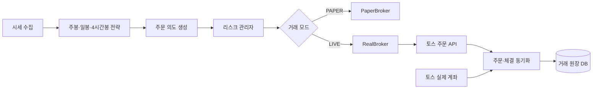

# 실거래 전환 작업계획

> 현재 시스템은 PAPER 전용이며, 이 문서는 실거래 전환을 위한 구현 계획이다. 단순한 모드 변경으로 실거래를 활성화하지 않고 계좌 동기화, 주문 상태 관리, 리스크 통제를 먼저 구축한다.

## 구현 현황

- [X] Broker 공통 인터페이스와 PAPER 호환 메서드
- [X] 토스 실계좌 읽기 전용 Broker
- [X] PAPER/LIVE DB 경로 분리 및 LIVE 설정 검증
- [X] 계좌·보유·매수 가능 금액·매도 가능 수량·주문 조회 클라이언트
- [X] LIVE 계좌 스냅샷과 원장 테이블
- [X] 주문 상태 머신
- [X] 실패 폐쇄형 LIVE 리스크 관리자
- [X] 읽기 전용 LIVE API와 선택적 API 토큰 보호
- [ ] 실제 주문 생성·정정·취소 전송 — 안전 검증 전까지 잠금
- [ ] 주문 이벤트 웹소켓과 재연결 복구
- [ ] Shadow 운용 데이터 축적 및 소액 실거래 승인

## 1. 목표 구조



전략은 매수·매도 의도만 생성하고, 실제 돈과 주문 상태는 `RealBroker`와 리스크 관리 계층이 담당한다.

## 2. 실거래 설정과 접근 통제

추가할 설정:

- `TRADER_MODE=paper|live`
- `TOSS_ACCOUNT_SEQ`
- `LIVE_TRADING_ENABLED`
- `LIVE_MAX_ORDER_AMOUNT_KRW`
- `LIVE_MAX_TOTAL_EXPOSURE_KRW`
- `LIVE_MAX_DAILY_LOSS_KRW`
- `LIVE_MAX_POSITION_LOSS_PERCENT`
- `LIVE_ALLOWED_SYMBOLS`
- `LIVE_REQUIRE_MANUAL_ARM`

안전 원칙:

- 기본값은 항상 `paper`로 설정한다.
- `TRADER_MODE=live`만 설정해서는 주문할 수 없게 한다.
- 실거래 활성화용 별도 스위치를 둔다.
- 서버가 재시작되면 실거래 스위치를 자동 해제한다.
- 화면과 API에 인증을 추가한다.
- 비밀키와 계좌 식별자는 DB와 화면에 표시하지 않는다.
- 실거래와 PAPER DB를 별도 파일로 분리한다.

완료 기준:

- 잘못된 계좌, 누락된 환경변수, PAPER DB 재사용 시 서버 시작을 거부한다.
- 실거래 활성 상태를 화면 전체에서 명확히 표시한다.

## 3. Broker 인터페이스 분리

공통 인터페이스:

```text
Broker
 ├─ get_accounts()
 ├─ get_cash()
 ├─ get_positions()
 ├─ get_buying_power()
 ├─ get_sellable_quantity()
 ├─ place_order()
 ├─ cancel_order()
 ├─ get_order()
 ├─ list_orders()
 └─ reconcile()
```

구현체:

- `PaperBroker`: 기존 가상계좌
- `TossRealBroker`: 토스 실제 계좌
- 전략 계층에서는 어떤 Broker가 연결됐는지 알 필요가 없도록 구성한다.

예상 파일:

- `app/brokers/base.py`
- `app/brokers/paper.py`
- `app/brokers/toss_real.py`
- `app/brokers/models.py`
- `app/brokers/factory.py`

완료 기준:

- 동일한 전략 테스트를 PAPER와 모의 `RealBroker` 양쪽에서 실행한다.
- 기존 PAPER 기능과 DB 기록을 그대로 유지한다.

## 4. 토스 계좌 조회 연동

먼저 주문 없이 읽기 전용 기능부터 구현한다.

연동 대상:

- 계좌 목록
- 실제 보유 종목
- 현금 및 평가금액
- 매수 가능 금액
- 매도 가능 수량
- 주문 내역과 상세
- 실제 수수료 정보
- 시장 운영 상태

화면에 표시할 정보:

- `PAPER 계좌` 또는 `토스 실계좌`
- 마지막 동기화 시각
- 동기화 성공 또는 실패
- DB와 실계좌 수량 불일치

완료 기준:

- 주문 권한을 끈 상태에서 실제 계좌 잔액과 보유 수량을 정확히 표시한다.
- 토스 앱/WTS 값과 종목별 수량·평가금액을 대조한다.
- 조회 실패 시 마지막 값을 현재 값처럼 사용하지 않고 `데이터 지연`으로 표시한다.

## 5. 실거래 주문 원장 설계

실거래 주문 기록 항목:

- 내부 주문 ID
- 증권사 주문 ID
- 클라이언트 주문 키
- 계좌 식별값의 비식별 참조
- 종목
- 매수·매도
- 주문 유형
- 주문 가격과 수량
- 체결 수량
- 평균 체결가
- 미체결 수량
- 수수료와 세금
- 주문 상태와 거부 사유
- 생성·접수·체결·취소 시각
- 전략 버전과 신호 ID
- PAPER/LIVE 구분

추가할 테이블:

- `broker_accounts`
- `live_orders`
- `live_executions`
- `live_positions`
- `account_snapshots`
- `reconciliation_events`
- `risk_events`
- `trading_audit_log`

완료 기준:

- 부분 체결 여러 건을 주문 하나에 정확히 합산한다.
- 주문 요청부터 최종 상태까지 모든 변경 이력을 보존한다.
- DB만 보고 실제 주문 진행 상태를 재구성할 수 있다.

## 6. 주문 상태 머신 구현

```text
CREATED
→ SUBMITTING
→ ACCEPTED
→ PARTIALLY_FILLED
→ FILLED

ACCEPTED/PARTIALLY_FILLED
→ CANCEL_REQUESTED
→ CANCELED

SUBMITTING
→ UNKNOWN
→ 조회를 통한 상태 복구

모든 단계
→ REJECTED 또는 FAILED
```

핵심 규칙:

- HTTP 타임아웃을 주문 실패로 단정하지 않는다.
- 타임아웃 뒤 주문 목록과 상세 조회로 접수 여부를 확인한다.
- 부분 체결 수량만 실제 보유 수량에 반영한다.
- 취소 요청 후 최종 취소 여부를 다시 조회한다.
- 동일 클라이언트 주문 키로 중복 주문을 방지한다.

완료 기준:

- 요청 응답 유실, 부분 체결, 취소 중 체결 시나리오 테스트를 통과한다.
- 상태가 `UNKNOWN`이면 신규 주문을 자동 중지한다.

## 7. 계좌 재동기화

서버 시작 시 로컬 DB를 신뢰하지 않고 실제 계좌를 기준으로 복구한다.

동기화 순서:

1. 자동주문 비활성 상태로 시작
2. 실제 계좌 잔고 조회
3. 실제 보유 종목 조회
4. 대기 주문과 당일 종료 주문 조회
5. DB 주문과 증권사 주문 ID 비교
6. 누락된 체결 기록 복구
7. 수량과 현금 차이 기록
8. 불일치가 없을 때만 실거래 활성화 허용

웹소켓 재연결 후에도 REST 주문 조회로 상태를 재동기화한다.

완료 기준:

- 주문 직후 프로세스를 강제 종료해도 재시작 후 상태를 복구한다.
- 토스 앱에서 수동 매매한 종목도 감지한다.
- 불일치 상태에서는 신규 매수를 차단한다.

## 8. 리스크 관리자 구현

모든 실주문은 전략에서 Broker로 바로 보내지 않고 리스크 관리자를 통과한다.

필수 제한:

- 주문 1건 최대 금액
- 종목별 최대 투자금
- 전체 투자금 한도
- 최대 보유 종목 수
- 일일 신규 매수 한도
- 일일 실현·평가 손실 한도
- 종목별 손절 기준
- 최대 보유 기간
- 동일 종목 재매수 대기시간
- 미체결 주문이 있는 종목의 반대 주문 제한
- 투자경고·위험·거래정지 종목 차단
- 시세 지연 시 주문 차단
- DB와 계좌 불일치 시 주문 차단

현재 50% 예산은 실계좌 평가금액이 아니라 현금 매수 가능 금액과 실제 보유 평가액을 바탕으로 다시 계산한다.

완료 기준:

- 모든 거부 사유를 `risk_events`에 기록한다.
- 한도 초과 주문이 토스 API로 전달되지 않게 한다.

## 9. 킬 스위치 재설계

킬 스위치를 세 단계로 분리한다.

- `BUY_PAUSED`: 신규 매수만 차단
- `ALL_NEW_ORDERS_PAUSED`: 신규 매수·매도 신호 차단
- `EMERGENCY_EXIT`: 대기 주문 취소 후 보유 종목 청산 시도

수동 매도와 비상청산은 신규 매수 킬 스위치와 분리한다.

완료 기준:

- 신규 매수 차단 상태에서도 수동 매도가 가능하다.
- 비상청산 진행 상태와 실패 종목을 확인할 수 있다.
- 비상청산 버튼은 구체적인 주문 목록을 보여준 뒤 최종 실행한다.

## 10. 주문 방식 결정

초기 실거래에서는 시장가보다 보호 지정가를 우선 검토한다.

매수:

- 최우선 매도호가 기준 허용 슬리피지 내 지정가
- 일정 시간 미체결 시 취소
- 자동 가격 추격 횟수 제한

매도:

- 일반 전략 매도는 보호 지정가
- 손실 제한 또는 비상청산은 별도 정책
- 호가와 거래량이 부족하면 주문 크기 축소

완료 기준:

- 예상 체결금액과 최대 허용가격을 주문 전에 표시한다.
- 주문 후 실제 평균 체결가와 예상가 차이를 기록한다.

## 11. 전략 검증

검증 대상:

- 주봉 MA10 방향
- 일봉 MA20·MA60 추세
- 합성 4시간봉 `BB(6,2)` 하단 3% 구간
- 일봉 `BB(20,2)` 상단 매도
- 손절이 없을 때 최대 낙폭
- 거래비용 포함 수익률
- 보유 기간 분포
- 종목·테마 집중도
- 장기 횡보 및 급락장에서의 성과

검증 단계:

1. 과거 데이터 백테스트
2. 워크포워드 테스트
3. 최소 수개월 PAPER 운용
4. 주문 실패와 시세 장애 모의 테스트
5. 실시간 Shadow 모드
6. 소액 실거래

Shadow 모드에서는 실제 주문을 보내지 않고, 보낼 예정이었던 주문과 이후 실제 체결 가능 가격을 기록한다.

## 12. 실거래 전환 단계

한 번에 전체 금액으로 전환하지 않는다.

1. 읽기 전용 실계좌 연결
2. Shadow 주문 기록
3. 수동 승인 후 1주 주문
4. 종목당 소액 자동주문
5. 최대 1종목
6. 최대 2~3종목
7. 설정한 전체 투자 한도까지 확대

각 단계의 승격 조건:

- 계좌 불일치 0건
- 중복 주문 0건
- 상태 미확인 주문 0건
- 주문 복구 테스트 통과
- 손실 제한 정상 동작
- 운영자가 실제 체결과 DB를 직접 대조

## 13. 구현 순서와 예상 범위

| 순서 | 작업                   | 예상 난이도 |
| ---: | ---------------------- | :---------: |
|    1 | 설정·실거래 잠금 구조 |    낮음    |
|    2 | Broker 인터페이스 분리 |    중간    |
|    3 | 읽기 전용 계좌 연동    |    중간    |
|    4 | 실거래 DB 원장         |    중간    |
|    5 | 주문 생성·조회·취소  |    높음    |
|    6 | 부분 체결 상태 머신    |    높음    |
|    7 | 시작·재연결 동기화    |    높음    |
|    8 | 리스크 관리자          |    높음    |
|    9 | 킬 스위치 분리         |    중간    |
|   10 | Shadow 및 소액 단계    |    중간    |
|   11 | 장애·복구 통합 테스트 |    높음    |
|   12 | 제한된 실거래 활성화   |  최종 단계  |

## 14. 첫 구현 범위

첫 작업에서는 다음까지만 구현한다.

1. Broker 인터페이스 분리
2. 토스 실계좌 읽기 전용 조회
3. 실거래 잠금 설정
4. PAPER와 LIVE 데이터 저장소 분리
5. 계좌와 DB의 보유 수량 비교

이 단계에서는 실제 주문을 전송하지 않는다. 읽기 전용 계좌 동기화가 안정적으로 동작한 뒤 주문 계층 구현으로 진행한다.

## 참고 자료

- [토스증권 Open API](https://developers.tossinvest.com/docs)
- [토스증권 주문 이벤트](https://developers.tossinvest.com/docs/order-event)
- [토스증권 시세 API](https://developers.tossinvest.com/docs/market-data)
